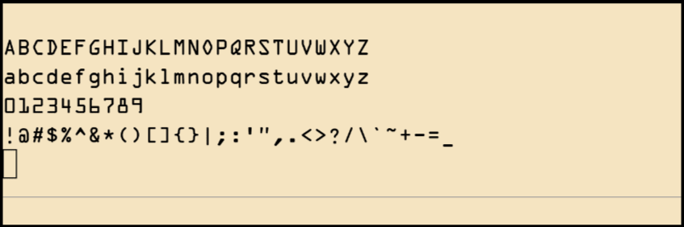
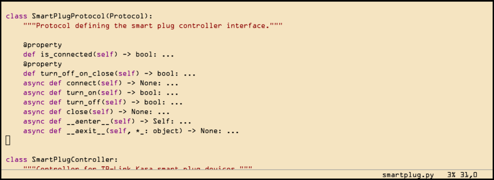

# ocrab

A monospaced font that combines **OCR-A** letterforms
(letters and digits) with **OCR-B** symbols (punctuation,
operators, brackets, and other non-alphanumeric glyphs).

The result is a hybrid that pairs the distinctive, geometric
character of OCR-A with the more legible symbols of OCR-B.

## Preview





## Building

The build script requires [FontForge](https://fontforge.org)
with Python scripting support, and the source fonts installed
locally.

### Source fonts

Download Matthew Skala's OCR-A and OCR-B from the
[Tsukurimashou project](https://tsukurimashou.osdn.jp/ocr.php.en)
and install them to `~/.local/share/fonts/`:

- `OCRA.otf`
- `OCRB.ttf`

The source fonts use different formats (OTF and TTF), but
FontForge handles the conversion transparently during the
build.

### Generate the font

```sh
make
```

To build and install to `~/.local/share/fonts/`:

```sh
make install
```

## Credits

ocrab is a derivative work based on:

- **OCR-A** by Matthew Skala (2011-2021), based on code
  by Richard B. Wales (1988-89) and Tor Lillqvist.
  Public domain (Skala's contributions).
- **OCR-B** by Matthew Skala (2011-2021), based on code
  by Norbert Schwarz (1986, 2011).
  Public domain (Skala's contributions). Schwarz's
  original Metafont source is unrestricted.

Both source fonts are from the
[Tsukurimashou project](https://tsukurimashou.osdn.jp/ocr.php.en).

## License

This font is licensed under the
[SIL Open Font License, Version 1.1](OFL.txt).
